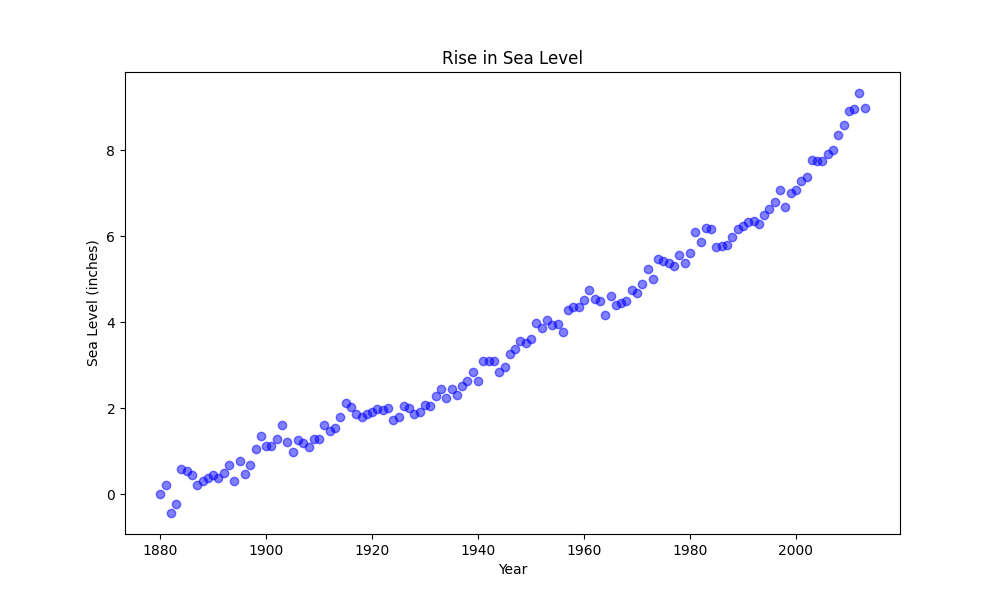
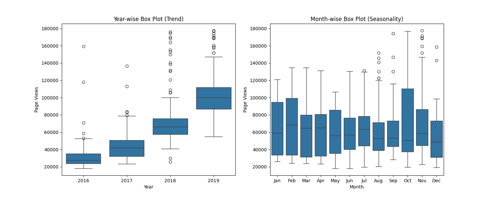
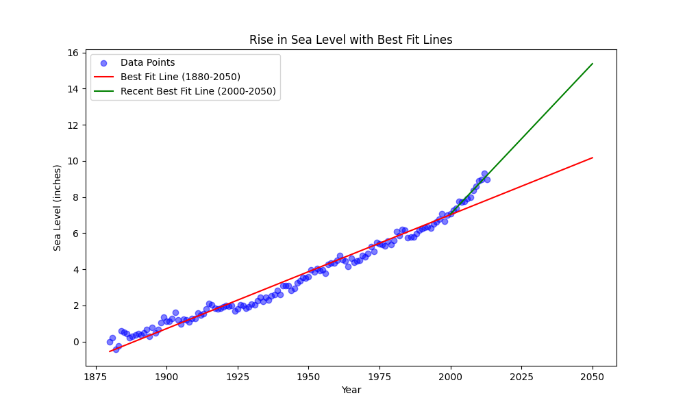

# 📊 Medical Data Analysis & Visualization

Bu proje, **tıbbi ve çevresel verileri analiz ederek çeşitli grafikler ve tahmin modelleri oluşturmayı amaçlamaktadır.**  

## 📌 Proje İçeriği:
- 📉 **Sea Level Prediction:** Tarihsel deniz seviyesi verilerini analiz edip, gelecekteki değişimleri tahmin eder.  
- 🏥 **Medical Examination Data:** Hasta verileri üzerinden istatistiksel analiz ve görselleştirme.  
- 📊 **Time Series Data Visualization:** Veri trendlerini görmek için interaktif grafikler oluşturur.  

## 📂 Çıktılar (Örnek Grafikler):
📌 **Deniz Seviyesi Artışı (Scatter Plot)**  
  

📌 **Box Plot ile Hasta Verisi Analizi**  
  

📌 **Deniz Seviyesi Tahmin Modeli**  
  

## 🔧 Kullanılan Teknolojiler:
- **Python, Pandas, Matplotlib, Seaborn**  
- **Machine Learning ve Veri Analizi Teknikleri**  

## 🔗 Proje Linki:
[GitHub Repository](https://github.com/cumute16/medical_data_project)
